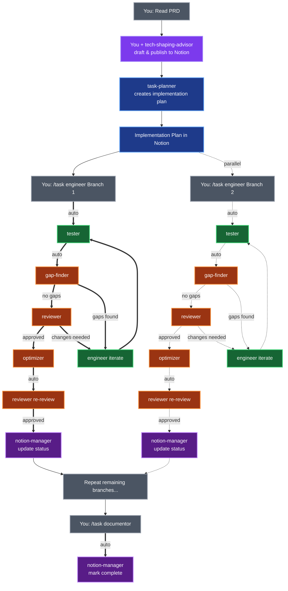

# Claude Code Configuration

Ten specialized AI agents that orchestrate your entire feature development workflow - from PRD to production.

**Think of these agents as teammates, not replacements.** They're specialists who collaborate with you, not autopilot that flies solo. Like any great team, the quality of their output depends on the clarity of your input - garbage in, garbage out still applies, but with the right direction, these agents can 10x your velocity.

## Why Multi-Agent?

**Single-agent AI** (like base Claude Code) is a generalist - good at everything, great at nothing. It treats tech shaping, implementation, and review as the same task.

**Multi-agent orchestration** gives you specialists:
- **Opus for critical thinking** (reviewer, gap-finder, tech-shaping-advisor, task-planner) - catches design flaws
- **Sonnet for implementation** (engineer, tester, optimizer, integration-tester, project-manager) - fast, proven patterns
- **Haiku for quick tasks** (documentor, notion-manager) - rapid documentation and status updates

**New capabilities based on [Claude Code autonomy features](https://www.anthropic.com/news/enabling-claude-code-to-work-more-autonomously):**
- **Parallel execution** - task-planner identifies independent branches that can be developed simultaneously
- **Background tasks** - engineer handles long-running operations (migrations, refactors) without blocking
- **Checkpoint/rollback** - reviewer provides rollback guidance for failed implementations
- **Quality gates** - gap-finder validates completeness before reviewer evaluates code

**Result:** Better code, fewer rewrites, faster shipping.

## Quick Start

1. **Install**: [Claude Code](https://docs.claude.com/en/docs/claude-code) + Anthropic API key
2. **Copy**: `cp -r agents ~/.claude/agents/`
3. **Use**: `/task task-planner https://notion.so/your-tech-shaping-doc`

Agents auto-discover from `~/.claude/agents/`. Optionally add the workflow to `CLAUDE.md` (see bottom) for proactive suggestions.

## The 10 Agents

| Agent | When to Use | Model | Auto-Delegates |
|-------|-------------|-------|----------------|
| 🔨 engineer | "Implement the auth service" | Sonnet | ✅ tester |
| 🧪 tester | "Write specs for the new API" | Sonnet | ✅ gap-finder |
| 🔍 reviewer | "Review before merging" | Opus | ✅ engineer/optimizer/notion-manager |
| ⚡ optimizer | "Refactor after it works" | Sonnet | ✅ reviewer |
| 📝 documentor | "Document the new feature" | Haiku | ✅ notion-manager |
| 🔌 integration-tester | "Test end-to-end flows" | Sonnet | ❌ |
| 🔎 gap-finder | "Find what's missing vs spec" | Opus | ✅ engineer/reviewer |
| 🎨 tech-shaping-advisor | "Help me draft tech spec sections" | Opus | ❌ |
| 📋 task-planner | "Create implementation plan" | Opus | ❌ |
| 🔄 notion-manager | "Sync status to Notion" | Haiku | ❌ |

## Complete Workflow Example

Starting with a PRD for a new "Gift Tracking" feature (ShapeUp cycle):

**1. Tech Shaping (You + AI)**
```bash
# You read PRD, use tech-shaping-advisor to help draft sections
/task tech-shaping-advisor Help me draft technical approach for gift tracking
```
→ You drive the process, AI assists with pattern research and section drafting
→ AI publishes completed tech shaping doc to Notion

**2. Planning (Mostly Autonomous)**
```bash
/task task-planner Create implementation plan from https://notion.so/gift-tracking-tech-shaping
```
→ Outputs: Implementation plan page in Notion with branches, acceptance criteria, dependencies
→ You review and may suggest alternative approaches

**3. Implementation - Per Branch (Smart Autonomous)**
```bash
# You trigger engineer, rest runs automatically:
/task engineer https://notion.so/implementation-plan#branch-1
  ↓ (automatic delegation)
  → tester → gap-finder → reviewer → optimizer → reviewer → notion-manager
```
→ Engineer auto-delegates through entire workflow until Notion updated
→ If gaps found or changes needed, auto-loops back to engineer
→ notion-manager verifies PR merged in git before updating Notion status

**4. Repeat for remaining branches**

**5. Integration testing (User-triggered when ready)**
```bash
/task integration-tester Test gift tracking end-to-end workflows
```
→ Outputs: Integration test suite, cross-service validation results

**6. Final documentation (User-triggered when all complete)**
```bash
/task documentor Document the gift tracking feature
```
→ documentor verifies all branches merged in git (reads Notion for branch list, checks git status)
→ If unmerged branches found, reports mismatch and blocks documentation
→ Outputs: API docs, usage guides
→ Auto-delegates to notion-manager to mark feature "Complete ✅"

## Optional Dependencies

**Notion integration** (tech-shaping-advisor, task-planner, notion-manager):
- [Notion MCP](https://mcp.notion.com/): `claude mcp add -t http notion https://mcp.notion.com/mcp`

**Babylist-specific** (tech-shaping-advisor, task-planner):
- `.knowledge/` directory with codebase patterns
- `.github/prompts/ai_tech_shaping.prompt.md` template

Agents gracefully degrade without these - skipping Notion publishing or using generic patterns.

## Merge Status Tracking (Hybrid Approach)

**Notion as coordination hub, Git as source of truth:**

- **notion-manager**: Verifies PR/branch merge status in git (`gh pr view` / `git branch --merged`) before updating Notion
- **documentor**: Reads branch list from Notion, verifies all merged in git before documenting
- **Status flow**: "In Progress" → "Review" → "Merged ✅" (verified in git) → "Complete ✅" (all branches merged + documented)
- **Discrepancy handling**: If Notion shows merged but git doesn't, agents report mismatch for manual resolution

This ensures Notion stays synchronized with git reality while using Notion for workflow coordination.

## How Agents Work Together



## Workflow (Add to CLAUDE.md)

Add this to your `CLAUDE.md` so Claude proactively suggests the right agent at the right time:

```markdown
## Agent Workflow

When working on new features, follow this ShapeUp workflow with AI agents:

### 1. PRD → Tech Shaping (Before Cycle)
- You read PRD and use `/task tech-shaping-advisor` to help draft sections
- You drive the process, AI assists with pattern research and drafting
- AI publishes completed tech shaping doc to Notion

### 2. Tech Shaping → Implementation Plan (Before Cycle)
- Use `/task task-planner` to create implementation plan from tech shaping doc
- Agent creates plan autonomously, you review and suggest alternatives
- Implementation plan in Notion becomes source of truth

### 3. Implementation (During Cycle)
Per branch - Smart Autonomous:
- You: `/task engineer` with Notion link or direct instructions
- Auto-chain: engineer → tester → gap-finder → reviewer → optimizer → reviewer → notion-manager
- Feedback loops: gaps found → engineer, changes needed → engineer
- You only trigger initial engineer, rest runs automatically

### 4. Integration Testing (When Ready)
- You: `/task integration-tester` to test end-to-end workflows
- Run after multiple branches merged, before final documentation
- Tests cross-service interactions and complete user journeys

### 5. Final Documentation (When All Complete)
- You: `/task documentor` to document completed feature
- Auto-chain: documentor → notion-manager (marks feature complete)
```
