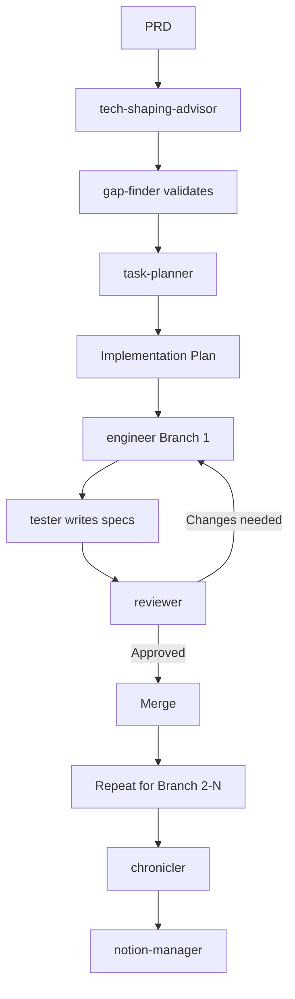

# Claude Code Configuration

Eleven specialized AI agents that orchestrate your entire feature development workflow - from PRD to production.

**Think of these agents as teammates, not replacements.** They're specialists who collaborate with you, not autopilot that flies solo. Like any great team, the quality of their output depends on the clarity of your input - garbage in, garbage out still applies, but with the right direction, these agents can 10x your velocity.

## Why Multi-Agent?

**Single-agent AI** (like base Claude Code) is a generalist - good at everything, great at nothing. It treats tech shaping, implementation, and review as the same task.

**Multi-agent orchestration** gives you specialists:
- **Opus for critical thinking** (reviewer, gap-finder, tech-shaping-advisor) - catches design flaws
- **Sonnet 3.5 for implementation** (engineer, tester) - fast, pattern-aware coding
- **Sonnet 4.5 for coordination** (project-manager, integration-tester) - prevents drift

**Result:** Better code, fewer rewrites, faster shipping.

## Quick Start

1. **Install**: [Claude Code](https://docs.claude.com/en/docs/claude-code) + Anthropic API key
2. **Copy**: `cp -r agents ~/.claude/agents/`
3. **Use**: `/task task-planner https://notion.so/your-tech-shaping-doc`

Agents auto-discover from `~/.claude/agents/`. Optionally add the workflow to `CLAUDE.md` (see bottom) for proactive suggestions.

## The 11 Agents

| Agent | When to Use | Model | Delegates |
|-------|-------------|-------|-----------|
| 🔨 engineer | "Implement the auth service" | Sonnet 3.5 | ❌ |
| 🧪 tester | "Write specs for the new API" | Sonnet 3.5 | ❌ |
| 🔍 reviewer | "Review before merging" | Opus | ✅ engineer |
| ⚡ optimizer | "Refactor after it works" | Sonnet 3.5 | ✅ engineer |
| 📝 chronicler | "Document the new feature" | Sonnet 3.5 | ✅ notion-manager |
| 🔌 integration-tester | "Test end-to-end flows" | Sonnet 4.5 | ❌ |
| 🔎 gap-finder | "Find what's missing vs spec" | Opus | ✅ engineer |
| 🎨 tech-shaping-advisor | "Turn PRD into tech spec" | Opus | ✅ gap-finder |
| 📋 task-planner | "Break into deployable chunks" | Opus | ✅ engineer |
| 🛡️ project-manager | "Prevent scope creep" | Sonnet 4.5 | ❌ |
| 🔄 notion-manager | "Sync status to Notion" | Sonnet 4.5 | ❌ |

## Complete Workflow Example

Starting with a PRD for a new "Gift Tracking" feature:

**1. Tech Shaping (5 min)**
```bash
/task tech-shaping-advisor Create tech shaping from https://notion.so/gift-tracking-prd
```
→ Outputs: Notion doc with architecture, data model, API contracts, risks

**2. Planning (3 min)**
```bash
/task task-planner Create implementation plan from https://notion.so/gift-tracking-tech-shaping
```
→ Outputs: 4 branches in Notion, Graphite stack structure, dependency diagram

**3. Implementation - Branch 1 (20 min)**
```bash
/task engineer Implement Branch 1: Database schema and models
/task tester Write specs for the gift tracking models
/task reviewer Review before merge
```
→ Outputs: PR ready with models, migrations, specs, all reviewed

**4. Repeat for remaining branches** (Branch 2-4)

**5. Final documentation**
```bash
/task chronicler Document the gift tracking feature
```
→ Outputs: API docs, usage guides, Notion status updated

**Total time:** ~2 hours of agent work vs ~2 days solo

## Optional Dependencies

**Notion integration** (tech-shaping-advisor, task-planner, notion-manager, project-manager):
- [Notion MCP](https://mcp.notion.com/): `claude mcp add -t http notion https://mcp.notion.com/mcp`

**Babylist-specific** (tech-shaping-advisor, task-planner):
- `.knowledge/` directory with codebase patterns
- `.github/prompts/ai_tech_shaping.prompt.md` template

Agents gracefully degrade without these - skipping Notion publishing or using generic patterns.

## Troubleshooting

**Agent doesn't exist when I run `/task`**
→ Check: `ls ~/.claude/agents/` - agents must be in this directory

**Agent ignores my instructions**
→ Be specific: Try "Implement X following pattern in file Y" instead of "add X"

**Agent creates files instead of editing**
→ Expected: Agents prefer editing. If creating, likely no existing pattern found

**Notion integration not working**
→ Check: `claude mcp list` to verify Notion MCP is installed

**Agent output doesn't match codebase style**
→ Check: Do you have `.knowledge/` files? Agents reference these for patterns

## Workflow (Add to CLAUDE.md)

Add this to your `CLAUDE.md` so Claude proactively suggests the right agent at the right time:



```markdown
## Agent Workflow

When working on new features, follow this agent orchestration workflow:

### 1. PRD → Tech Shaping
- Use `/task tech-shaping-advisor` to create tech shaping document
- Delegates to `gap-finder` for validation

### 2. Tech Shaping → Implementation Plan
- Use `/task task-planner` to break into deployable branches
- Creates Graphite workflow + Notion tracking

### 3. Implementation
- Use `/task engineer` for each branch
- Use `/task project-manager` to enforce scope
- Use `/task tester` for specs
- Use `/task reviewer` before merge

### 4. Documentation
- Use `/task chronicler` when complete
- Delegates to `notion-manager` for updates
```
