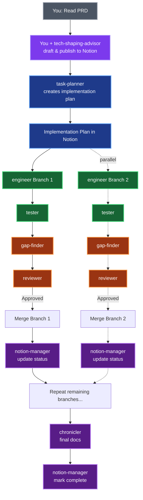

# Claude Code Configuration

Eleven specialized AI agents that orchestrate your entire feature development workflow - from PRD to production.

**Think of these agents as teammates, not replacements.** They're specialists who collaborate with you, not autopilot that flies solo. Like any great team, the quality of their output depends on the clarity of your input - garbage in, garbage out still applies, but with the right direction, these agents can 10x your velocity.

## Why Multi-Agent?

**Single-agent AI** (like base Claude Code) is a generalist - good at everything, great at nothing. It treats tech shaping, implementation, and review as the same task.

**Multi-agent orchestration** gives you specialists:
- **Opus for critical thinking** (reviewer, gap-finder, tech-shaping-advisor, task-planner) - catches design flaws
- **Sonnet for implementation** (engineer, tester, optimizer, integration-tester, project-manager) - fast, proven patterns
- **Haiku for quick tasks** (chronicler, notion-manager) - rapid documentation and status updates

**New capabilities based on [Claude Code autonomy features](https://www.anthropic.com/news/enabling-claude-code-to-work-more-autonomously):**
- **Parallel execution** - task-planner identifies independent branches that can be developed simultaneously
- **Background tasks** - engineer handles long-running operations (migrations, refactors) without blocking
- **Checkpoint/rollback** - reviewer provides rollback guidance for failed implementations
- **Quality gates** - gap-finder validates completeness before reviewer evaluates code

**Result:** Better code, fewer rewrites, faster shipping.

## Quick Start

1. **Install**: [Claude Code](https://docs.claude.com/en/docs/claude-code) + Anthropic API key
2. **Copy**: `cp -r agents ~/.claude/agents/`
3. **Use**: `/task task-planner https://notion.so/your-tech-shaping-doc`

Agents auto-discover from `~/.claude/agents/`. Optionally add the workflow to `CLAUDE.md` (see bottom) for proactive suggestions.

## The 11 Agents

| Agent | When to Use | Model | Delegates |
|-------|-------------|-------|-----------|
| 🔨 engineer | "Implement the auth service" | Sonnet | ❌ |
| 🧪 tester | "Write specs for the new API" | Sonnet | ❌ |
| 🔍 reviewer | "Review before merging" | Opus | ✅ engineer |
| ⚡ optimizer | "Refactor after it works" | Sonnet | ✅ engineer |
| 📝 chronicler | "Document the new feature" | Haiku | ✅ notion-manager |
| 🔌 integration-tester | "Test end-to-end flows" | Sonnet | ❌ |
| 🔎 gap-finder | "Find what's missing vs spec" | Opus | ✅ engineer |
| 🎨 tech-shaping-advisor | "Help me draft tech spec sections" | Opus | ❌ |
| 📋 task-planner | "Create implementation plan" | Opus | ❌ |
| 🛡️ project-manager | "Prevent scope creep" | Sonnet | ❌ |
| 🔄 notion-manager | "Sync status to Notion" | Haiku | ❌ |

## Complete Workflow Example

Starting with a PRD for a new "Gift Tracking" feature (ShapeUp cycle):

**1. Tech Shaping (You + AI)**
```bash
# You read PRD, use tech-shaping-advisor to help draft sections
/task tech-shaping-advisor Help me draft technical approach for gift tracking
```
→ You drive the process, AI assists with pattern research and section drafting
→ AI publishes completed tech shaping doc to Notion

**2. Planning (Mostly Autonomous)**
```bash
/task task-planner Create implementation plan from https://notion.so/gift-tracking-tech-shaping
```
→ Outputs: Implementation plan page in Notion with branches, acceptance criteria, dependencies
→ You review and may suggest alternative approaches

**3. Implementation - Per Branch (Agent-Driven)**
```bash
# Agent reads complete spec from Notion implementation plan
/task engineer https://notion.so/implementation-plan#branch-1
/task tester Write specs for the gift tracking models
/task gap-finder Check implementation completeness vs spec
/task reviewer Review before merge
```
→ After merge: notion-manager updates branch status in Notion automatically

**4. Repeat for remaining branches**

**5. Final documentation**
```bash
/task chronicler Document the gift tracking feature
```
→ Outputs: API docs, usage guides
→ notion-manager marks feature complete in Notion

## Optional Dependencies

**Notion integration** (tech-shaping-advisor, task-planner, notion-manager, project-manager):
- [Notion MCP](https://mcp.notion.com/): `claude mcp add -t http notion https://mcp.notion.com/mcp`

**Babylist-specific** (tech-shaping-advisor, task-planner):
- `.knowledge/` directory with codebase patterns
- `.github/prompts/ai_tech_shaping.prompt.md` template

Agents gracefully degrade without these - skipping Notion publishing or using generic patterns.

## How Agents Work Together



## Workflow (Add to CLAUDE.md)

Add this to your `CLAUDE.md` so Claude proactively suggests the right agent at the right time:

```markdown
## Agent Workflow

When working on new features, follow this ShapeUp workflow with AI agents:

### 1. PRD → Tech Shaping (Before Cycle)
- You read PRD and use `/task tech-shaping-advisor` to help draft sections
- You drive the process, AI assists with pattern research and drafting
- AI publishes completed tech shaping doc to Notion

### 2. Tech Shaping → Implementation Plan (Before Cycle)
- Use `/task task-planner` to create implementation plan from tech shaping doc
- Agent creates plan autonomously, you review and suggest alternatives
- Implementation plan in Notion becomes source of truth

### 3. Implementation (During Cycle)
Per branch:
- Use `/task engineer` with Notion link or direct instructions
- Use `/task tester` for specs
- Use `/task gap-finder` to validate completeness
- Use `/task reviewer` before merge
- notion-manager updates Notion status automatically after merge

### 4. Final Documentation (End of Cycle)
- Use `/task chronicler` to document completed feature
- notion-manager marks feature complete in Notion
```
